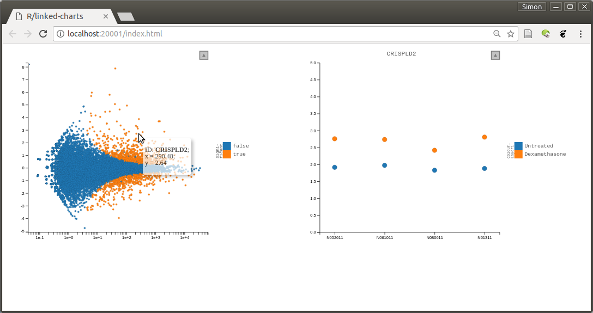

# Differential Expression Analysis

In the previous lesson, we have preprocessed the RNA-Seq data from the "airway"
study (Himes et al.: *RNA-Seq transcriptome profiling identifies CRISPLD2 as a glucocorticoid responsive gene that modulates cytokine function in airway smooth muscle cells.* [PLoS One, 2014, 9:](doi.org://10.1371/journal.pone.0099625) using the Subread aligner. We have used the featureCount tool from the Subread package to count how many reads map to each of genes in each sample.
We have saved the result in the file `featureCount.out`.

## Load count matrix and run table

Let's first load this file. It is a data table with tab-separated values (TSV),
i.e., TAB characters are used to mark the column boundaries. There are some extra lines at the top,
marked with the hash sign (`#`), that are not part of the table. We tell the tidyverse read function
to ignore them:

```{r}
library( tidyverse )

read_tsv( "RNASeq/airway/featureCounts.out", comment = "#" ) 
```

We only want the actual data columns, which all contain the string `bam` in their columns name, we
want to use the gene IDs as row names, and this should be stored not as a data frame or tibble,
but as a matrix:

```{r}
read_tsv( "RNASeq/airway/featureCounts.out", comment = "#" ) %>%
  column_to_rownames( "Geneid" ) %>%
  select( starts_with("alignment") ) %>%
  as.matrix ->
     countsMatrix

countsMatrix[1:5,1:5]
```

Next, we simplify the column names:
```{r}
colnames(countsMatrix) %>% 
   str_remove( "alignments/" ) %>% 
   str_remove( ".bam" ) -> 
      colnames(countsMatrix)

countsMatrix[1:5,1:5]

```

What do the sample IDs mean? To see, we load the run table that we have downloaded
from ENA last time:

```{r}
read_tsv( "RNASeq/airway/run_table.txt" )
```

We select only the columns we need, and parse the `treatment` column

```{r}
read_tsv( "RNASeq/airway/run_table.txt") %>%
  select( run = Run, cell_line, treatment ) %>%
  mutate( albuterol = str_detect( treatment, "Albuterol" ) ) %>%
  mutate( dexamethasone = str_detect( treatment, "Dexamethasone" ) ) ->
     run_table

run_table
```

It's important for what follows that the columns in `countsMatrix` and the run IDs in
the run table agree and are in the same order. Let's check that

```{r}
stopifnot( all( run_table$run == colnames(countsMatrix) ) )
```


## Differential expression analysis

Now, we can perform a standard differential expression analysis, e.g., using DESeq (Love et al,
[Genome Biology 15:550](http://doi.org/10.1186/s13059-014-0550-8), 2014).

```{r}
library( DESeq2 )
```

In DESeq2, all processing happens within a `DESeqDataSet` object, which is derived from
Bioconductor's `SummerizedExperiment` class. To make such an object, bind together a
matrix of read counts with a data frame that describes the columns of the count matrix.
The third element is the design formula, which is put together using the column names from the
data frame. We will discuss it later.

```{r}
dds0 <- DESeqDataSetFromMatrix( countsMatrix, run_table, ~ cell_line + dexamethasone )
dds0
```

We first analyse only the dexamethasone and hence remove all samples treated with abluterol.

```{r}
dds <- dds0[ , !dds0$albuterol ]
dds
```


The actual analysis is done with a single command:
```{r}
dds <- DESeq( dds )
```

Let's check the results:

```{r}
res <- results( dds )

res
```

Note the first line. These are the results for comparing the cases with dexamethasone versus the
controls. If this is not what you want, you have to specify the correct *contrast* when calling `results`.


How many genes are significant at 10% false discovery rate?

```{r}
sum( res$padj < .1, na.rm=TRUE )
```

To get a first overview over the results table, we can ask for an MA plot
```{r}
plotMA( dds, ylim = c(-4,4) )
```

We can also do the MA plot manually: this will look more familiar to you, as you have learned how to use ggplot in the previous lessons

```{r}
as_tibble(res) %>%
   mutate( signif = !is.na(padj) & padj < .1 ) %>%
ggplot( ) +
   geom_point(
      aes(
         x = baseMean,
         y = log2FoldChange,
         col = signif
      )
   ) +
   scale_x_log10() +
   scale_y_continuous( oob = scales::squish )
```

Another useful plot is the vulcano plot

```{r}
as_tibble(res) %>%
   mutate( signif = !is.na(padj) & padj < .1 ) %>%
ggplot( ) +
   geom_point(
      aes(
         x = log2FoldChange,
         y = -log10( pvalue),
         col = signif
      )
   ) +
   scale_x_continuous( oob = scales::squish ) +
   scale_y_continuous( oob = scales::squish, limits = c( 0, 100 ) ) +
   scale_color_manual( values = c( "black", "red" ) )
```

## Getting gene names

So far, the rows in our result list are labelled only with Ensembl gene IDs (ENSG0000...), which are not very helpful. We need a mapping to gene names. We can download a table with such a mapping from [Ensembl Biomart](https://www.ensembl.org/biomart/). There, choose, "Ensebl Genes", "Human Genes", then click on "Attributes" to select the table columns we want to get: Ensembl gene ID ("gene stable ID") and "Gene name". In case we need it, let's also add "Chromosome name", "Gene start", "Gene end", "Strand" and "Gene type". Deselect "Transcript stable ID": we want one row per gene, not per transcript. No "Filters", either: we want all genes. Click on "Results" to see the table and export it to a file in TSV format.

Load that file in R

```{r}
read_tsv("RNASeq/airway/mart_export.txt")
```

Using tidyverse's `left_join` function, we can merge this table into our results table

```{r}
res %>%
   as_tibble( rownames = "EnsemblID" ) %>%
   left_join( 
      read_tsv( "RNASeq/airway/mart_export.txt" ),
      by = c( "EnsemblID" = "Gene stable ID" ) ) %>%
   mutate( signif = !is.na(padj) & padj < .1 ) ->
     res

res
```

Now, we can have a look at the most significantly upregulated genes:

```{r}
res %>%
   arrange( -sign( log2FoldChange ), padj )
```


## Plotting some genes

Let's have a look at one of the these genes. We simply get a row from the normalized count matrix, using DESeq2's `counts` function, turn this row to a column and add it to the run table (which we can get back from `dds` with `colData`). Then we have all we need to use ggplot. 

```{r}
gene <- "ENSG00000189221"

colData(dds) %>%
   as_tibble() %>%
   mutate( ncount = counts( dds, normalized=TRUE )[ gene, ] ) %>%
ggplot +
   geom_point(
      aes(
         x = cell_line,
         y = ncount,
         col = treatment
      )
   ) +
   scale_y_continuous( trans = "log1p" )
```

# Doing this interactively

We (Svetlana Ovchinnikova and I) have recently released the first version of our [LinkedCharts frame work](https://anders-biostat.github.io/linked-charts/).

To see it in action, use the following code.

```r
library( rlc )

openPage( useViewer=FALSE, layout="table2x2" )

lc_scatter(
   dat(
      x = res$baseMean,
      y = res$log2FoldChange,
      colorValue = res$signif,
      label = res$`Gene name`,
      on_click = function(k) { gene <<- k; updateCharts("A2") }
   ),
   place = "A1",
   logScaleX = 10,
   size = 2,
   colourLegendTitle = "significant"
)

lc_scatter(
   dat(
      x = colData(dds)$cell_line,
      y = log10( 1 + counts( dds, normalized=TRUE )[ gene, ] ),
      colourValue = colData(dds)$treatment,
      title = res$`Gene name`[ gene ]
   ),
   place = "A2",
   domainY = c( 0, 5 )
)
```
You will see an interactive app that allows you to click on genes in the MA plot
and so get a detailed plot to the right:


 

Finally, we save the workspace (i.e., all variables), so that we can continue from here next time.
 
```{r}
save.image( "lecture8.rda" )
```